<div align="center">
  

  # Wavora

  **A free, open-source, cross-platform YouTube Music client — built with Kotlin Multiplatform & Compose.**

  [](https://github.com/Wavora-dev/Wavora/releases)
  [](LICENSE)
  [](https://kotlinlang.org)
  [](https://www.jetbrains.com/lp/compose-multiplatform/)
  [](https://kotlinlang.org/docs/multiplatform.html)
  [](https://github.com/Wavora-dev/Wavora/releases)
  [](https://github.com/Wavora-dev/Wavora/releases)
  [](https://github.com/Wavora-dev/Wavora)
  [](https://github.com/Wavora-dev/Wavora/stargazers)
  [](https://github.com/Wavora-dev/Wavora/network/members)
  [](https://github.com/Wavora-dev/Wavora/issues)

  [Releases](https://github.com/Wavora-dev/Wavora/releases) · [Report a bug](https://github.com/Wavora-dev/Wavora/issues) · [Español ↓](#-wavora-en-español)

</div>

---

<div align="center">
  <sub>🇺🇸 English</sub>
</div>

## Hero

Wavora is a music player that streams directly from YouTube Music — no ads, no subscription, no account required to start listening. It runs natively on **Android**, **Windows**, **macOS**, and **Linux** from a single Kotlin Multiplatform codebase, sharing virtually all of its business logic, data layer, and UI between every target.

The project's philosophy is simple: **one shared brain, native everywhere.** Instead of a web wrapper or a Java-to-JS bridge, Wavora's playback engine, database, networking layer, and 20+ full screens of Compose UI are the *same Kotlin code* running against ExoPlayer/Media3 on Android and libVLC on desktop — with only the thin platform edges (`expect`/`actual`) written per target.

Wavora's goal isn't to be "yet another YouTube Music wrapper." It exists to push a self-hosted, community-driven alternative to paid streaming: real crossfade with DJ-style mixing, a synced-lyrics ecosystem with AI translation, a genuinely native desktop app (not Electron), and a codebase that's continuously audited and hardened rather than left to bit-rot.

## Why Wavora?

**The problem:** most "free YouTube Music" clients are either Android-only, poorly maintained forks that break every few months, or Electron wrappers on desktop that eat gigabytes of RAM to play an MP3.

**What Wavora does differently:**

- **Genuinely native on every platform.** The desktop build isn't a browser in a box — it's a Compose Desktop application backed by libVLC through JNA/vlcj, with a real system tray, a floating always-on-top miniplayer window, and OS-level media integrations (macOS Now Playing Center, Windows protocol handler for `wavora://` deep links).
- **A real crossfade engine**, not a fade-in/fade-out hack — equal-power volume curves, an optional biquad-filter DJ Mode, and BPM/key-aware AutoMix, implemented in parallel on both the ExoPlayer (Android) and VLC (Desktop) backends.
- **A community lyrics ecosystem** with its own Cloudflare Workers backend, AI-powered translation, and a voting system — instead of only scraping a single third-party source.
- **No telemetry by default**, an optional non-Sentry crash-reporting build flavor (`crashlytics-empty`), proxy support, and a Piped-instance fallback for restricted networks.
- **A codebase that's actively being hardened**, not just feature-added: memory leaks, race conditions, main-thread database access, and startup performance have all been systematically found and fixed (see [What's new compared to SimpMusic](#whats-new-compared-to-simpmusic)).

## Features

### 🎵 Playback
- Stream any song, album, playlist, or podcast from YouTube Music
- Background playback with a persistent media-session notification (Android) and system tray (Desktop)
- **Crossfade** between tracks, configurable from 1–30 seconds or fully automatic
  - **DJ Mode** — biquad low-pass/high-pass filter sweep layered on top of the volume fade
  - **AutoMix** — reads BPM/key metadata to adjust crossfade duration and blend tempo
- Next-track precaching for gapless-style transitions
- Repeat (off / one / all), shuffle, and an endless queue (auto-radio once the queue ends)
- Sleep timer (fixed minutes or "end of current song")
- Skip-silence and SponsorBlock (automatic sponsor-segment skipping on music videos)
- Loudness normalization across tracks
- Selectable audio/video quality tiers
- Offline downloads for songs, videos, full albums, and full playlists, with an "audio-only for video tracks" toggle
- Playback state (track, queue, shuffle/repeat) is restored across app restarts

### 🎤 Lyrics
- **Wavora community lyrics** — synced lyrics served by Wavora's own Cloudflare Workers backend, with an opt-in "help build the database" contribution flow
- **LRCLIB** and **BetterLyrics** as additional open fallback providers
- **Spotify** synced lyrics via the user's own `sp_dc` cookie
- **YouTube** auto-generated captions as a last-resort fallback
- **AI translation** of any synced lyric set to any language, via OpenAI, Gemini, or a custom model endpoint
- Word-level highlight for rich synced lyrics, with binary-search line lookup
- Upvote/downvote voting on original and translated lyrics
- Blurred, fullscreen lyrics view; lyrics are cached for offline access

### ❤️ Library
- Favorites (liked songs), downloaded tracks, followed artists
- Local and YouTube-synced albums and playlists — create, edit, reorder, delete
- Recently played, most played, and top tracks/artists/albums with a date-range filter (analytics)
- Podcasts
- Two-way sync of liked music and playlists with your YouTube Music account
- Offline "keep" — cache YouTube playlists for offline browsing without downloading every track

### 🔍 Search & Discovery
- Search songs, albums, artists, playlists, videos, and podcasts, filterable by type
- Search history shown as quick-tap chips
- Real-time YouTube Music search suggestions
- Moods & genres browser, personalized recommendations on the home feed
- YouTube-style radio ("start radio" from any track)

### 🤖 AI
- AI-powered lyrics translation (OpenAI, Gemini, or self-hosted/custom model endpoint), configurable per-provider with your own API key
- Community-sourced BPM/key metadata feeding the AutoMix crossfade engine

### ☁ Cloud & Social Integration
- **YouTube / Google account** login (cookie-based, no OAuth app registration needed), with multi-account support and listening-history upload for better recommendations
- **Discord Rich Presence** — shows the current track, artist, and elapsed time in your Discord status via a direct WebSocket gateway connection (uses your own user token, not a bot)
- **Spotify integration** — `sp_dc` cookie login for synced lyrics and animated Spotify Canvas backgrounds on the Now Playing screen

### 🎨 UI & Personalization
- Material 3 (Expressive) design system with full light/dark theming that follows the OS
- Liquid Glass blur/refraction effect on supported Android versions
- Animated, album-art-driven blurred background on the Now Playing screen
- Translucent, configurable bottom navigation bar
- Animated 3-page onboarding flow shown once on first launch
- Skeleton loading states and retry-capable error states across Artist/Album/Library/Playlist screens
- Haptic feedback on every playback control (Android)
- Configurable app language and content region

### 📱 Platform
- **Android** — background service with media-session notification, home-screen widget (Glance), Discord/Spotify/YouTube login flows
- **Desktop (Windows / macOS / Linux)** — standalone windowed app, floating draggable miniplayer window, full-screen player, custom title bar, scrollbars, VLC-based playback (libVLC)
  - macOS Now Playing Center + Remote Command Center (media keys, lock-screen widget)
  - Windows custom protocol handler (`wavora://`) for deep links
  - System tray integration

### 💾 Data
- Full backup and restore of library, playlists, and settings (zip export/import)
- Automatic backups on a configurable schedule (daily / weekly / monthly)
- Granular cache management: player cache, thumbnail cache, lyrics-Canvas cache, downloaded-files cache
- Backward-compatible with pre-existing SimpMusic local databases

### 🛡 Privacy & Network
- No analytics and no telemetry by default
- A separate build flavor (`crashlytics-empty`) that removes Sentry crash reporting entirely — for users who want zero outbound diagnostic traffic
- HTTP/SOCKS5 proxy support with authentication, for restricted network environments
- Optional Piped-instance backend as an alternative streaming data source
- Opt-in-only contribution to the community lyrics database

### ⚙ Configuration
- Manual and automatic update checks with a toggle for the auto-check-on-launch behavior
- Optional Android "keep background service alive" setting to reduce playback interruptions from battery optimization
- Per-feature toggles for crossfade, SponsorBlock, normalization, silence-skip, quality tiers, and more, all under Settings

## What's new compared to SimpMusic

Wavora started as a fork of [SimpMusic](https://github.com/maxrave-dev/SimpMusic) — the original Android YouTube Music client this project owes its playback and data foundations to. But over the course of development, the codebase went through a sustained audit-and-rewrite cycle rather than a simple rebrand, and a large share of the app has since been rewritten, replaced, or newly built.

**What was inherited from SimpMusic:** the original architectural approach (Compose + Media3 + Room + Koin + a YouTube Music scraping layer), the core screen set, and the general product concept (ad-free YouTube Music streaming with downloads and a library).

**What was rebuilt into a genuinely multiplatform app:**
- A full **Kotlin Multiplatform / Compose Multiplatform desktop target** was added from scratch — Windows, macOS, and Linux, with a VLC-based playback backend (`core/media/media-jvm`) written in parallel to the Android ExoPlayer/Media3 backend (`core/media/media3`), behind a shared `PlayerSession`/`PlayerController` abstraction so the rest of the app (ViewModels, screens) talks to a single unified playback contract regardless of platform.
- The **crossfade engine** (equal-power volume curves, DJ Mode's biquad filter sweep, and BPM/key-aware AutoMix) was implemented twice, independently, once per platform's native player.
- The **lyrics backend** was migrated off a dead first-party API to a new Cloudflare Workers service (D1 + KV + Queues + a Durable Object), with a clean provider-registry architecture (`core/service/lyricsService`) so Wavora's own lyrics, LRCLIB, and BetterLyrics are pluggable fallbacks instead of hardcoded calls.
- The monolithic ~2000-line `SharedViewModel` was split into focused, single-responsibility ViewModels (`PlayerViewModel`, `NowPlayingViewModel`, `AppViewModel`) coordinated by a thin backward-compatible `SharedViewModel` facade, so every existing screen kept working unchanged.
- Discord Rich Presence, Spotify integration, and YouTube account login all gained **guided, in-app, step-by-step setup flows** (cookie copy helpers, connection diagnostics) instead of requiring manual browser DevTools work.
- A from-scratch **onboarding flow**, skeleton loading states, retry-capable error states, and a consistent haptic-feedback layer were added across the UI.
- A **home-screen Android widget** (Glance) and a **desktop floating miniplayer window** were both added as new surfaces that didn't exist before.

**What was fixed, hardened, and optimized:**
- A production out-of-memory leak in the Koin-singleton ViewModel graph (fixed with an explicit `forceClear()` lifecycle hook)
- Multiple `LazyColumn`/`LazyRow` duplicate-key crashes on both platforms
- Database access moved off the main thread across all repositories
- A cross-platform race condition where the next track in a crossfade could start already paused
- ExoPlayer buffer sizing halved (was buffering up to ~800 s of audio across 4 simultaneous player instances)
- Startup-time work audited and deferred/lazily-loaded where it wasn't needed on the critical path
- Typography and color-token duplication consolidated into single sources of truth
- Room indices added for frequently-filtered columns (`liked`, `downloadState`, `totalPlayTime`, `inLibrary`)

**What was newly added, with no SimpMusic equivalent:** the entire desktop application, the AI lyrics translation pipeline, the community lyrics voting system, SponsorBlock integration, backup/restore with scheduled auto-backup, analytics-style top tracks/artists/albums with date filtering, Discord/Spotify guided setup, and the `wavora://` deep-link protocol handler on Windows.

None of this is meant to diminish SimpMusic — it's the foundation this project was built on, and its architectural choices (Compose, Media3, Koin, Room) are still visible throughout Wavora today. The goal of this section is simply to be transparent about how far the codebase has moved since the fork.

## Architecture

Wavora is a **Kotlin Multiplatform** project. Shared Kotlin code targets both `android` and `jvm` (desktop) from a single source tree, with platform-specific code isolated behind `expect`/`actual` declarations only where truly unavoidable (media playback backend, file pickers, clipboard, window chrome, etc.).

```
┌──────────────────────────────────────────────────────────────┐
│  androidApp / desktopApp   — thin platform entry points       │
│  (Activity / main(), widgets, notification channels)          │
├──────────────────────────────────────────────────────────────┤
│  composeApp (commonMain)   — UI layer                         │
│  Compose Multiplatform screens · ViewModels · navigation      │
│  PlayerViewModel · NowPlayingViewModel · AppViewModel          │
│  (coordinated by a thin SharedViewModel facade)                │
├──────────────────────────────────────────────────────────────┤
│  core/data                 — repositories, Room DB, DataStore  │
│  core/domain                — domain models, repository        │
│                                interfaces, use-case contracts  │
│  core/common                — shared constants/utilities       │
├──────────────────────────────────────────────────────────────┤
│  core/media/media3          — Android playback (ExoPlayer)     │
│  core/media/media-jvm       — Desktop playback (libVLC/vlcj)   │
│  core/media/media3-ui       │
│  core/media/media-jvm-ui    — platform player-UI adapters      │
├──────────────────────────────────────────────────────────────┤
│  core/service/*             — kotlinYtmusicScraper (YT Music   │
│                                API client), lyricsService,      │
│                                aiService, spotify, kizzy        │
│                                (Discord RPC gateway), ktorExt   │
├──────────────────────────────────────────────────────────────┤
│  crashlytics / crashlytics-empty — pluggable crash-reporting   │
│                                     build flavor (Sentry / no-op)│
└──────────────────────────────────────────────────────────────┘
```

- **Dependency injection:** [Koin](https://insert-koin.io) across every layer. Most screen ViewModels are scoped per-navigation-entry via `viewModel {}`; the playback-related ViewModels are registered as `single {}` singletons so they survive navigation, with an explicit lifecycle hook (`forceClear()`) to avoid leaking on Activity recreation.
- **Networking:** [Ktor](https://ktor.io) client, shared across platforms, used by the YouTube Music scraper, the lyrics backend client, the AI service client, and Spotify integration.
- **Persistence:** [Room](https://developer.android.com/jetpack/androidx/releases/room) (via the KMP-compatible `androidx.sqlite` bundled driver) for the local database, and Jetpack [DataStore](https://developer.android.com/topic/libraries/architecture/datastore) (Preferences) for settings/flags.
- **Background work:** Android `WorkManager` for periodic artist-update notifications and scheduled auto-backups.
- **Media pipeline:** a shared `PlayerSession` / `PlayerController` contract (queue, playback state, progress, repeat/shuffle/volume/buffering/error) is derived from each platform's native player handler, so ViewModels and UI never talk to ExoPlayer or VLC directly.
- **State:** unidirectional data flow with Kotlin `StateFlow`/`SharedFlow`, consumed in Compose via `collectAsStateWithLifecycle`.

## Tech Stack

| Layer | Technology |
|---|---|
| Language | Kotlin 2.4.0 |
| UI | Compose Multiplatform 1.11.1, Material 3 (Expressive), Material 3 Adaptive |
| Multiplatform | Kotlin Multiplatform (Android + JVM/Desktop targets) |
| Dependency Injection | Koin 4.2.1 (koin-core, koin-android, koin-compose-viewmodel) |
| Networking | Ktor Client 3.5.0 (CIO / OkHttp engines), OkHttp 5.3.2 |
| Serialization | kotlinx.serialization, kotlinx.datetime |
| Local Database | Room 2.8.4 + androidx.sqlite (bundled driver, KMP-compatible) |
| Key-Value Storage | Jetpack DataStore (Preferences) 1.2.1 |
| Android Playback | Media3 / ExoPlayer 1.10.1 |
| Desktop Playback | VLC via vlcj 4.12.1 + JNA |
| Background Work | WorkManager 2.11.2 |
| Image Loading | Coil 3.4.0 |
| Crash Reporting | Sentry 8.43.1 (pluggable, no-op flavor available) |
| Logging | Kermit 2.1.0 |
| Android Widgets | Jetpack Glance 1.1.1 |
| YouTube Extraction | NewPipeExtractor, BravePipeExtractor, PipePipeExtractor (fallback chain) |
| Discord RPC | Kizzy (WebSocket Discord Gateway client) |
| AI / Translation | OpenAI & Gemini-compatible client (`gemini-kotlin`) |
| Blur / Effects | Haze 1.7.2, Liquid Glass (`backdrop`/`shapes`) |
| Animations | Compottie 2.2.1 (Lottie for Compose Multiplatform) |
| Navigation | Jetpack Navigation Compose 2.9.2 |
| Paging | Jetpack Paging 3.5.0 |
| Desktop Packaging | Compose Desktop native distributions + Hydraulic Conveyor |
| Build System | Gradle 9.5.1, JDK 21 toolchain |

## Screenshots

<h3 align="center">🖥️ Windows</h3>

<p align="center">
  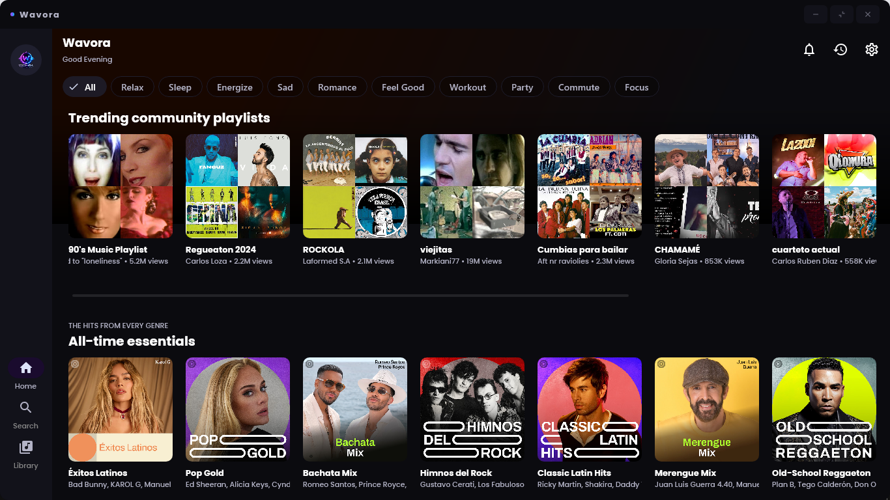
  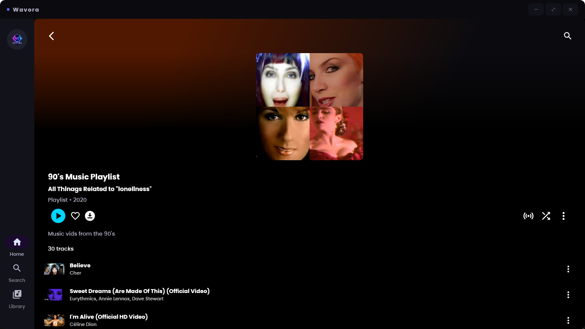
  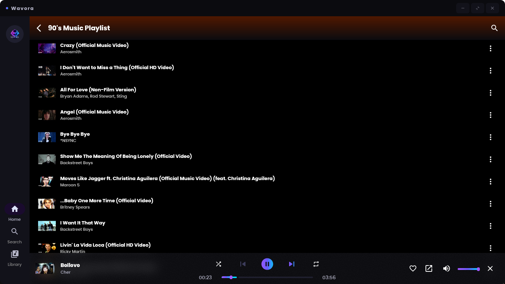
</p>

<p align="center">
  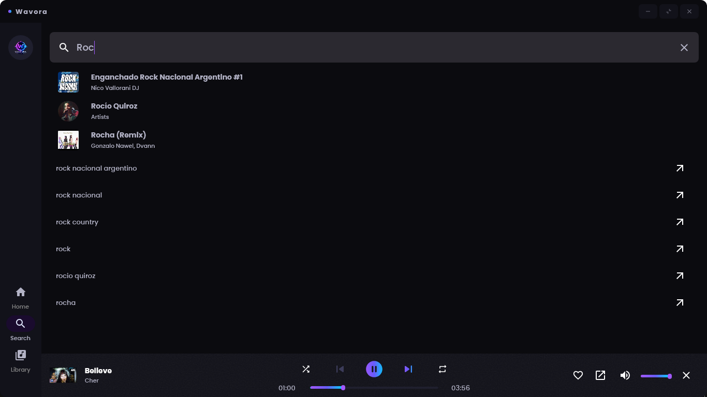
  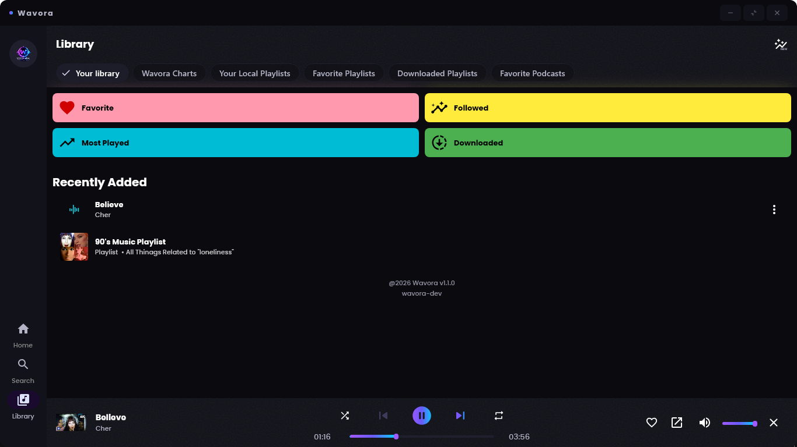
  
</p>

<br>

<h3 align="center">📱 Android</h3>

<p align="center">
  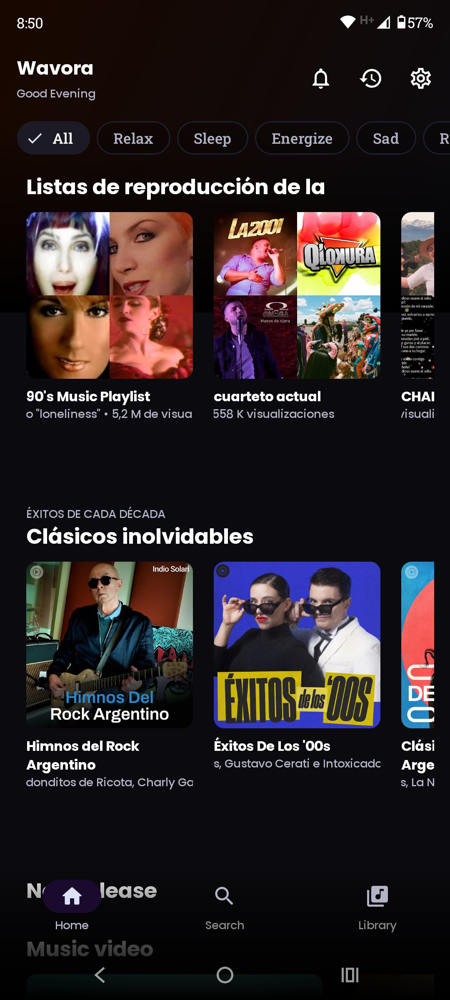
  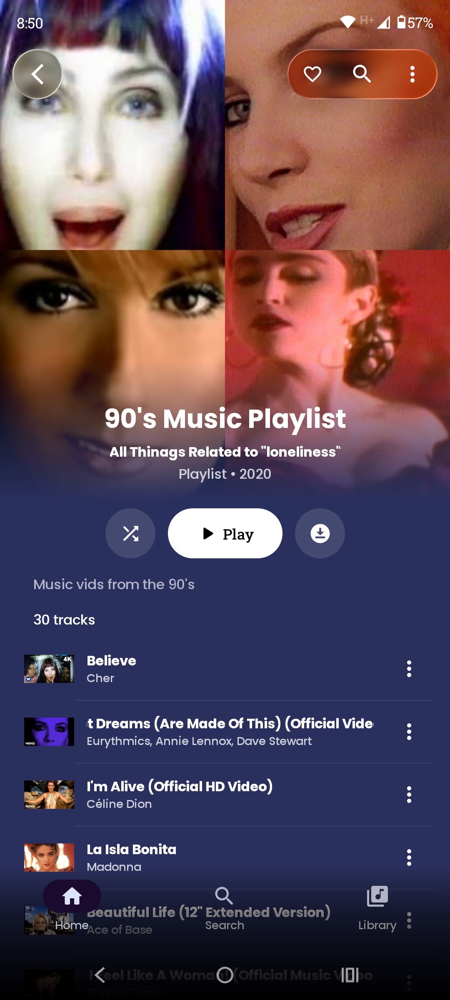
  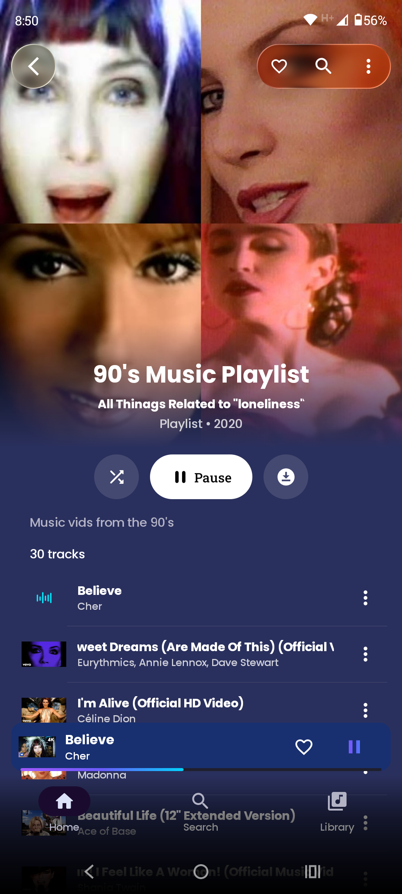
</p>

<p align="center">
  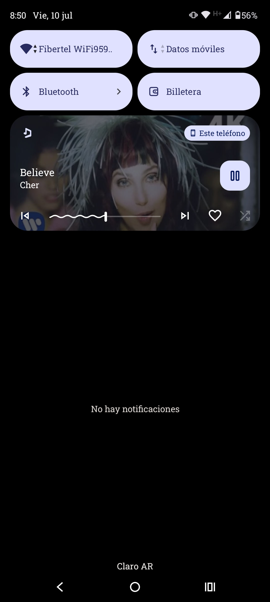
  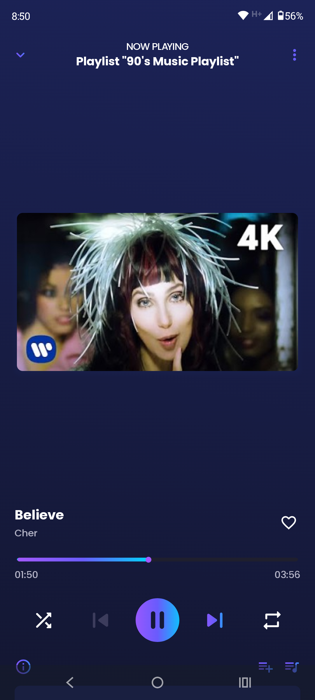
  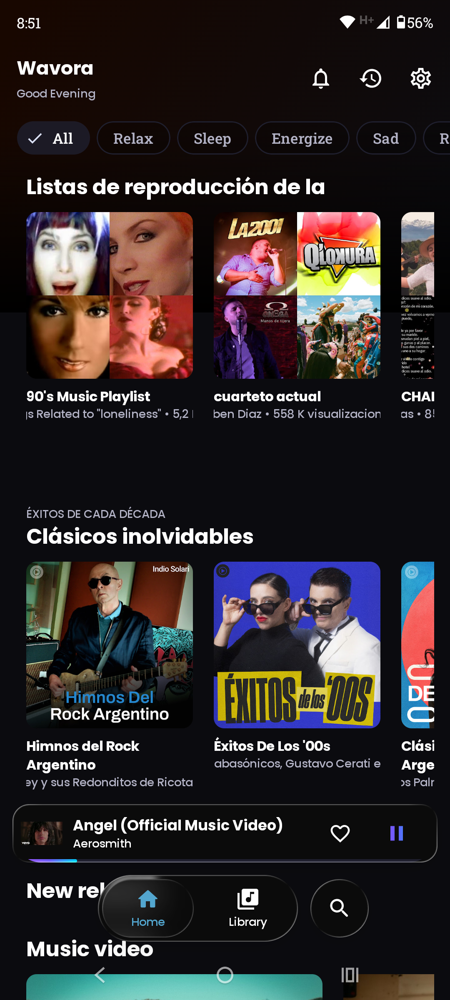
</p>

<p align="center">
  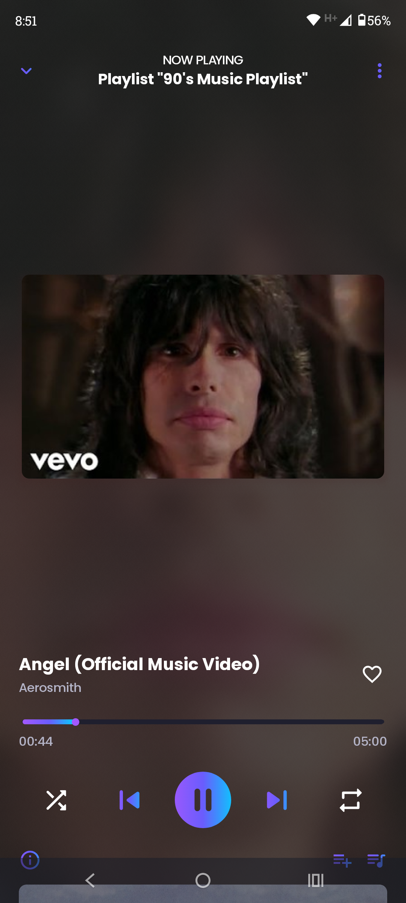
  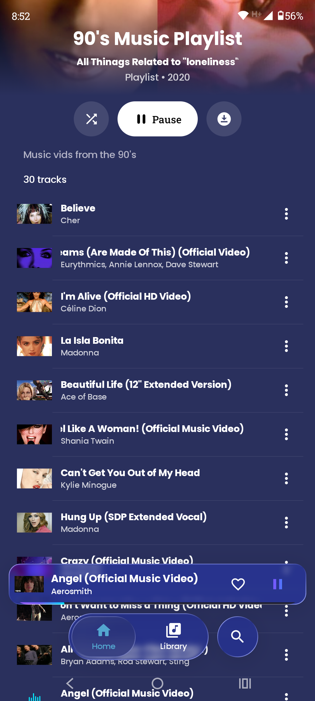
  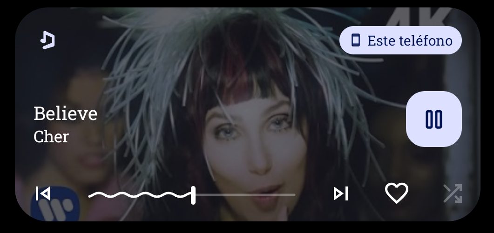
</p>


## Installation

### Android
Download the latest `.apk` from [Releases](https://github.com/Wavora-dev/Wavora/releases). Requires **Android 8.0 (API 26) or newer**.

### Windows
Download the `.msi` installer from [Releases](https://github.com/Wavora-dev/Wavora/releases). Requires [VLC](https://www.videolan.org/vlc/) (64-bit) installed on the system.

### macOS
Download the `.dmg` from [Releases](https://github.com/Wavora-dev/Wavora/releases). Requires VLC installed.

### Linux
Download the `.AppImage` from [Releases](https://github.com/Wavora-dev/Wavora/releases), mark it executable, and run it. Requires VLC (`libvlc`) installed on the system.

## Building

### Requirements
- **JDK 21** (Gradle toolchain is pinned to 21)
- **Android SDK** (`compileSdk 37`, `minSdk 26`, `targetSdk 36`) for the Android target — install via Android Studio
- **VLC** installed locally, for running/testing the Desktop target
- Gradle Wrapper is included (Gradle 9.5.1) — no local Gradle install needed

### With Android Studio / IntelliJ IDEA
Open the project root — both IDEs will pick up the Kotlin Multiplatform + Compose Multiplatform Gradle configuration automatically. Select the `androidApp` run configuration for Android, or run the `desktopApp` Gradle `run` task for Desktop.

### From the command line

```bash
git clone https://github.com/Wavora-dev/Wavora
cd Wavora

# One-time: download and stage VLC's native libraries for the desktop target
./gradlew :composeApp:vlcSetup --no-configuration-cache

# Android — debug/release APK
./gradlew :androidApp:assembleDebug
./gradlew :androidApp:assembleRelease

# Desktop — run directly
./gradlew :desktopApp:run

# Desktop — native installers (per-OS, run on the matching host)
./gradlew :desktopApp:packageMsi        # Windows
./gradlew :desktopApp:packageDmg        # macOS
./gradlew :desktopApp:packageAppImage   # Linux
```

> On Windows, use `gradlew.bat` instead of `./gradlew`.

## Project Structure

```
Wavora/
├── androidApp/            Android entry point (Activity, widget, background workers)
├── desktopApp/             Desktop entry point (main(), Conveyor packaging config)
├── composeApp/             Shared Compose Multiplatform UI (screens, ViewModels, DI wiring)
│   └── src/
│       ├── commonMain/     Shared UI code (screens, components, theming, i18n resources)
│       ├── androidMain/    Android-only UI glue (expect/actual)
│       └── jvmMain/        Desktop-only UI glue (miniplayer window, title bar, tray)
├── core/
│   ├── common/             Shared constants and small utilities
│   ├── domain/             Domain models, repository interfaces
│   ├── data/                Room database, DataStore, repository implementations
│   ├── media/
│   │   ├── media3/          Android playback engine (ExoPlayer/Media3)
│   │   ├── media3-ui/       Android player UI adapters
│   │   ├── media-jvm/       Desktop playback engine (VLC/vlcj)
│   │   └── media-jvm-ui/    Desktop player UI adapters
│   └── service/
│       ├── kotlinYtmusicScraper/  YouTube Music API client
│       ├── lyricsService/         Lyrics provider registry (Wavora / LRCLIB / BetterLyrics)
│       ├── aiService/              AI translation client (OpenAI/Gemini-compatible)
│       ├── spotify/                Spotify cookie-based integration
│       ├── kizzy/                  Discord Rich Presence WebSocket gateway client
│       └── ktorExt/                Shared Ktor client extensions
├── crashlytics/            Sentry-backed crash reporting
├── crashlytics-empty/      No-op crash reporting build flavor
├── config/                 License/library metadata for the in-app credits screen
├── fastlane/               Android store metadata
└── scripts/windows/        Windows-specific build helper scripts
```

## Performance

Real, code-verified optimizations, not aspirational claims:

- **Reduced player buffer footprint** — ExoPlayer's target buffer was halved after auditing that up to 4 simultaneous player instances (crossfade + precache) could otherwise buffer ~800 seconds of audio in parallel.
- **Cached typography** — `Typography` is computed once via a `CompositionLocal` instead of being recreated on every composable call site.
- **Bounded image cache** — Coil's `MemoryCache` is explicitly capped at 10% of available heap instead of the platform default.
- **Deferred/lazy service construction** — Spotify, AI, and lyrics HTTP clients are only constructed on first real use instead of eagerly at app startup (`createdAtStart` audited and removed where unnecessary).
- **Off-main-thread database access** — all Room repository operations run on `Dispatchers.IO`.
- **Reduced unnecessary recomposition** — the shared `PlayerSession` adapter applies targeted `distinctUntilChanged()` filtering so unrelated `ControlState` changes (e.g. a volume drag) don't force a shuffle/repeat recomputation, and `TimeLine` fields that rarely change are isolated from the 10×/second position tick with `derivedStateOf` in the Now Playing screens.
- **Fixed a Koin-singleton ViewModel leak** that caused a cumulative out-of-memory condition after repeated app open/close cycles in production, via an explicit `forceClear()` lifecycle hook.
- **Throttled background integrations** — Discord Rich Presence updates are rate-limited instead of firing on every state tick.

## Accessibility

- `contentDescription` labels are set on interactive and image-only elements across the shared UI (buttons, artwork, playback controls) so screen readers (TalkBack on Android, VoiceOver on macOS) can announce them correctly.
- The app is localized into **25+ languages** (see `composeApp/src/commonMain/composeResources/values-*`), with per-language string resources kept in sync as part of ongoing maintenance, so accessibility tooling and translated content ship together.
- Theming respects the OS-level light/dark mode preference.
- Haptic feedback provides a non-visual confirmation channel for every playback control on Android.

## Privacy

- **No analytics or telemetry are collected by the app itself.**
- Crash reporting is powered by [Sentry](https://sentry.io) and is **opt-out at the build level**: the `crashlytics-empty` module is a drop-in, no-op replacement for the Sentry-backed `crashlytics` module, for anyone who wants a build with zero outbound diagnostic traffic.
- Login to YouTube, Discord, or Spotify is entirely **cookie/token-based and local** — Wavora does not run its own OAuth backend or proxy your credentials through a third-party server.
- HTTP/SOCKS5 **proxy support** (with authentication) is available for users on restricted or monitored networks.
- An optional **Piped instance** can be configured as an alternative source for streaming data, for users who prefer not to hit YouTube's endpoints directly.
- Contribution to the community lyrics database is **strictly opt-in** and disabled by default.
- The self-hosted lyrics backend (Cloudflare Workers) only receives lyrics-related requests (fetch/vote/contribute) — it is a separate project from the app itself and does not proxy general YouTube Music traffic.

## Roadmap

Sourced directly from `// TODO` markers currently present in the codebase — nothing here is invented:

- **Shuffle order persistence** — the shuffle-order logic (`core/media/media3/.../BetterShuffleOrder.kt`) has known rough edges: "play next" ordering doesn't currently survive an unshuffle operation, and the underlying algorithm is flagged internally for a cleaner rewrite.
- **Discord Gateway connection-wait strategy** — the Discord Rich Presence WebSocket client (`core/service/kizzy`) currently uses a workaround while waiting for the socket to report as connected to the user's account; a more robust wait strategy is planned.
- **JVM (Desktop) loudness enhancer** — desktop playback normalization currently mirrors Android's behavior at the application level; a native VLC-side loudness enhancer is a known gap, noted directly in `JvmMediaPlayerHandlerImpl.kt`.
- **Desktop UI extension hook** — a platform-specific UI extension point on the JVM target (`UIExt.jvm.kt`) is currently a stub, reserved for a future desktop-specific enhancement.

## Credits

Wavora is built on top of [**SimpMusic**](https://github.com/maxrave-dev/SimpMusic) by **maxrave-dev**, licensed under GPL-3.0 — the original Android YouTube Music client this project's playback pipeline, data layer, and general architecture trace back to.

Wavora would not be possible without the following open-source projects: **Jetpack Compose** & **Compose Multiplatform**, **Media3/ExoPlayer**, **VLC** & **vlcj**, **Koin**, **Ktor**, **Room**, **Coil**, **NewPipeExtractor**, **BravePipeExtractor**, **PipePipeExtractor**, **Kizzy**, **Sentry**, **Kermit**, **Haze**, **Compottie**, and every other library listed under **Settings → Third-party libraries** inside the app itself, powered by AboutLibraries.

## License

Wavora is licensed under the **GNU General Public License v3.0**. See [LICENSE](LICENSE) for the full text.

---
---

<div align="center">
  <sub id="-wavora-en-español">🇪🇸 Español</sub>
</div>

## Presentación

Wavora es un reproductor de música que transmite directamente desde YouTube Music — sin publicidad, sin suscripción, y sin necesidad de cuenta para empezar a escuchar. Funciona de forma nativa en **Android**, **Windows**, **macOS** y **Linux** desde una única base de código en Kotlin Multiplatform, compartiendo prácticamente toda la lógica de negocio, la capa de datos y la interfaz entre cada plataforma.

La filosofía del proyecto es simple: **un solo cerebro compartido, nativo en todos lados.** En lugar de un wrapper web o un puente Java-a-JS, el motor de reproducción, la base de datos, la capa de red y más de 20 pantallas completas hechas en Compose son *el mismo código Kotlin* corriendo sobre ExoPlayer/Media3 en Android y sobre libVLC en escritorio — con solo los bordes específicos de cada plataforma (`expect`/`actual`) escritos por separado cuando es estrictamente necesario.

El objetivo de Wavora no es ser "otro wrapper más de YouTube Music". Existe para impulsar una alternativa autoalojada y guiada por la comunidad frente al streaming pago: crossfade real con mezcla estilo DJ, un ecosistema de letras sincronizadas con traducción por IA, una app de escritorio genuinamente nativa (no Electron), y una base de código que se audita y endurece de forma continua en vez de quedar abandonada.

## ¿Por qué Wavora?

**El problema:** la mayoría de los clientes "gratuitos de YouTube Music" son o bien exclusivos de Android, forks mal mantenidos que se rompen cada pocos meses, o wrappers de Electron en escritorio que consumen gigabytes de RAM solo para reproducir un MP3.

**Qué hace Wavora distinto:**

- **Genuinamente nativo en cada plataforma.** La build de escritorio no es un navegador metido en una caja — es una aplicación de Compose Desktop respaldada por libVLC a través de JNA/vlcj, con una bandeja del sistema real, una ventana de miniplayer flotante siempre-encima, e integraciones nativas del sistema operativo (Now Playing Center en macOS, manejador de protocolo `wavora://` para deep links en Windows).
- **Un motor de crossfade real**, no un simple fundido de entrada/salida — curvas de volumen de potencia constante, un Modo DJ opcional con barrido de filtro biquad, y AutoMix consciente del BPM/tonalidad, implementado en paralelo tanto en el backend de ExoPlayer (Android) como en el de VLC (Escritorio).
- **Un ecosistema de letras comunitario** con su propio backend en Cloudflare Workers, traducción impulsada por IA, y un sistema de votación — en lugar de depender de un único proveedor externo.
- **Sin telemetría por defecto**, una variante de build sin Sentry (`crashlytics-empty`) para no enviar ningún reporte de errores, soporte de proxy, y una instancia Piped como alternativa en redes restringidas.
- **Una base de código que se sigue endureciendo activamente**, no solo se le agregan funciones: fugas de memoria, condiciones de carrera, acceso a la base de datos desde el hilo principal, y el rendimiento de arranque fueron encontrados y corregidos de forma sistemática (ver [Novedades respecto a SimpMusic](#novedades-respecto-a-simpmusic)).

## Funcionalidades

### 🎵 Reproducción
- Reproducí cualquier canción, álbum, playlist o podcast de YouTube Music
- Reproducción en segundo plano con notificación persistente de sesión de medios (Android) y bandeja del sistema (Escritorio)
- **Crossfade** entre canciones, configurable de 1 a 30 segundos o totalmente automático
  - **Modo DJ** — barrido de filtro biquad pasa-bajos/pasa-altos superpuesto al fundido de volumen
  - **AutoMix** — lee metadatos de BPM/tonalidad para ajustar la duración del crossfade y mezclar el tempo
- Precarga de la siguiente canción para transiciones estilo "sin cortes"
- Repetir (desactivado / una / todas), aleatorio, y cola infinita (radio automática al terminar la cola)
- Timer de sueño (minutos fijos o "al terminar la canción actual")
- Omitir silencios y SponsorBlock (salteo automático de segmentos de patrocinadores en videos musicales)
- Normalización de volumen entre canciones
- Niveles de calidad de audio/video seleccionables
- Descargas offline de canciones, videos, álbumes completos y playlists completas, con un interruptor de "solo audio en pistas con video"
- El estado de reproducción (canción, cola, aleatorio/repetir) se restaura entre reinicios de la app

### 🎤 Letras
- **Letras comunitarias de Wavora** — letras sincronizadas servidas por el propio backend de Wavora en Cloudflare Workers, con un flujo opcional de "ayudar a construir la base de datos"
- **LRCLIB** y **BetterLyrics** como proveedores adicionales de respaldo, abiertos
- Letras sincronizadas de **Spotify** vía la cookie `sp_dc` propia del usuario
- Subtítulos autogenerados de **YouTube** como último recurso
- **Traducción con IA** de cualquier conjunto de letras sincronizadas a cualquier idioma, vía OpenAI, Gemini, o un endpoint de modelo propio
- Resaltado palabra por palabra en letras sincronizadas enriquecidas, con búsqueda binaria de línea actual
- Votación (a favor/en contra) sobre letras originales y traducidas
- Vista de letras en pantalla completa con fondo difuminado; las letras se cachean para acceso sin conexión

### ❤️ Biblioteca
- Favoritos (canciones que te gustan), pistas descargadas, artistas seguidos
- Álbumes y playlists locales y sincronizados con YouTube — crear, editar, reordenar, eliminar
- Reproducidas recientemente, más reproducidas, y top de canciones/artistas/álbumes con filtro por rango de fechas (analíticas)
- Podcasts
- Sincronización bidireccional de música que te gusta y playlists con tu cuenta de YouTube Music
- "Mantener" sin conexión — cachear playlists de YouTube para navegarlas offline sin descargar cada pista

### 🔍 Búsqueda y descubrimiento
- Buscá canciones, álbumes, artistas, playlists, videos y podcasts, filtrable por tipo
- Historial de búsqueda mostrado como chips de acceso rápido
- Sugerencias de búsqueda de YouTube Music en tiempo real
- Explorador de estados de ánimo y géneros, recomendaciones personalizadas en la pantalla principal
- Radio estilo YouTube ("iniciar radio" desde cualquier canción)

### 🤖 IA
- Traducción de letras impulsada por IA (OpenAI, Gemini, o un endpoint de modelo propio/autoalojado), configurable por proveedor con tu propia API key
- Metadatos de BPM/tonalidad aportados por la comunidad que alimentan el motor de crossfade AutoMix

### ☁ Integración en la nube y social
- Inicio de sesión con cuenta de **YouTube/Google** (basado en cookies, sin necesidad de registrar una app OAuth), con soporte multicuenta y subida del historial de escucha para mejores recomendaciones
- **Discord Rich Presence** — mostrá la canción actual, el artista y el tiempo transcurrido en tu estado de Discord vía una conexión directa por WebSocket al Gateway (usa tu propio token de usuario, no un bot)
- **Integración con Spotify** — inicio de sesión con cookie `sp_dc` para letras sincronizadas y fondos animados de Spotify Canvas en la pantalla de reproducción

### 🎨 UI y personalización
- Sistema de diseño Material 3 (Expressive) con theming completo claro/oscuro que sigue al sistema operativo
- Efecto de blur/refracción Liquid Glass en versiones compatibles de Android
- Fondo animado y difuminado impulsado por la portada del álbum en la pantalla de reproducción
- Barra de navegación inferior translúcida y configurable
- Flujo de bienvenida (onboarding) animado de 3 páginas, mostrado una sola vez en el primer inicio
- Estados de carga tipo skeleton y estados de error con reintento en las pantallas de Artista/Álbum/Biblioteca/Playlist
- Feedback háptico en cada control de reproducción (Android)
- Idioma de la app y región de contenido configurables

### 📱 Plataforma
- **Android** — servicio en segundo plano con notificación de sesión de medios, widget de pantalla de inicio (Glance), flujos de inicio de sesión de Discord/Spotify/YouTube
- **Escritorio (Windows / macOS / Linux)** — app de ventana independiente, miniplayer flotante y arrastrable, reproductor en pantalla completa, barra de título personalizada, scrollbars, reproducción basada en VLC (libVLC)
  - Now Playing Center + Remote Command Center en macOS (teclas multimedia, widget de pantalla de bloqueo)
  - Manejador de protocolo personalizado (`wavora://`) para deep links en Windows
  - Integración con la bandeja del sistema

### 💾 Datos
- Backup y restauración completos de biblioteca, playlists y configuración (exportación/importación en zip)
- Backups automáticos con frecuencia configurable (diaria / semanal / mensual)
- Gestión granular de caché: caché del reproductor, de miniaturas, de Canvas de letras, y de archivos descargados
- Compatible hacia atrás con bases de datos locales preexistentes de SimpMusic

### 🛡 Privacidad y red
- Sin analíticas ni telemetría por defecto
- Una variante de build separada (`crashlytics-empty`) que elimina por completo el reporte de errores de Sentry — para quienes quieran una build sin ningún tráfico de diagnóstico saliente
- Soporte de proxy HTTP/SOCKS5 con autenticación, para entornos de red restringidos
- Instancia opcional de **Piped** como fuente alternativa de datos de streaming
- La contribución a la base de datos comunitaria de letras es **estrictamente opcional** y está desactivada por defecto

### ⚙ Configuración
- Chequeo manual y automático de actualizaciones, con interruptor para el comportamiento de auto-chequeo al iniciar
- Ajuste opcional en Android para "mantener el servicio en segundo plano activo" y reducir interrupciones de reproducción por la optimización de batería del sistema
- Interruptores por función para crossfade, SponsorBlock, normalización, salteo de silencios, niveles de calidad, y más, todo dentro de Ajustes

## Novedades respecto a SimpMusic

Wavora comenzó como un fork de [**SimpMusic**](https://github.com/maxrave-dev/SimpMusic) — el cliente original de YouTube Music para Android al que este proyecto le debe sus bases de reproducción y capa de datos. Pero a lo largo del desarrollo, la base de código pasó por un ciclo sostenido de auditoría y reescritura en vez de un simple cambio de marca, y una parte importante de la app fue reescrita, reemplazada, o construida desde cero.

**Qué se heredó de SimpMusic:** el enfoque arquitectónico original (Compose + Media3 + Room + Koin + una capa de scraping de YouTube Music), el conjunto base de pantallas, y el concepto general de producto (streaming de YouTube Music sin publicidad, con descargas y biblioteca).

**Qué se reconstruyó para volverlo una app genuinamente multiplataforma:**
- Se agregó desde cero un **target completo de escritorio en Kotlin Multiplatform / Compose Multiplatform** — Windows, macOS y Linux, con un backend de reproducción basado en VLC (`core/media/media-jvm`) escrito en paralelo al backend de ExoPlayer/Media3 de Android (`core/media/media3`), detrás de una abstracción compartida `PlayerSession`/`PlayerController` para que el resto de la app (ViewModels, pantallas) hable con un único contrato de reproducción sin importar la plataforma.
- El **motor de crossfade** (curvas de volumen de potencia constante, barrido de filtro biquad del Modo DJ, y AutoMix consciente del BPM/tonalidad) se implementó dos veces, de forma independiente, una por cada reproductor nativo de cada plataforma.
- El **backend de letras** se migró de una API propia ya inactiva a un nuevo servicio en Cloudflare Workers (D1 + KV + Queues + un Durable Object), con una arquitectura limpia de registro de proveedores (`core/service/lyricsService`) para que las letras propias de Wavora, LRCLIB y BetterLyrics sean respaldos intercambiables en vez de llamadas hardcodeadas.
- El monolítico `SharedViewModel` de ~2000 líneas se dividió en ViewModels enfocados y con responsabilidad única (`PlayerViewModel`, `NowPlayingViewModel`, `AppViewModel`), coordinados por una fachada `SharedViewModel` delgada y retrocompatible, de modo que cada pantalla existente siguió funcionando sin cambios.
- Discord Rich Presence, la integración con Spotify, y el login de cuenta de YouTube incorporaron **flujos de configuración guiados, paso a paso, dentro de la app** (ayudantes para copiar cookies, diagnóstico de conexión) en lugar de requerir trabajo manual con las DevTools del navegador.
- Se agregó un **flujo de onboarding** construido desde cero, estados de carga tipo skeleton, estados de error con reintento, y una capa consistente de feedback háptico en toda la interfaz.
- Se sumaron un **widget de Android para la pantalla de inicio** (Glance) y una **ventana de miniplayer flotante en escritorio**, ambas superficies completamente nuevas que no existían antes.

**Qué se corrigió, endureció y optimizó:**
- Una fuga de memoria de producción en el grafo de ViewModels registrados como singleton en Koin (corregida con un hook de ciclo de vida explícito `forceClear()`)
- Múltiples crashes por claves duplicadas en `LazyColumn`/`LazyRow` en ambas plataformas
- Acceso a la base de datos movido fuera del hilo principal en todos los repositorios
- Una condición de carrera multiplataforma donde la siguiente canción de un crossfade podía arrancar ya pausada
- El tamaño del buffer de ExoPlayer se redujo a la mitad (llegaba a bufferear hasta ~800 s de audio en paralelo con 4 instancias de reproductor simultáneas)
- Se auditó y difirió/hizo perezoso el trabajo de arranque que no era necesario en el camino crítico
- Se consolidó la duplicación de tokens de tipografía y color en fuentes únicas de verdad
- Se agregaron índices de Room para columnas frecuentemente filtradas (`liked`, `downloadState`, `totalPlayTime`, `inLibrary`)

**Qué se agregó de cero, sin equivalente en SimpMusic:** toda la aplicación de escritorio, el pipeline de traducción de letras con IA, el sistema de votación de letras comunitarias, la integración de SponsorBlock, el backup/restauración con auto-backup programado, las analíticas de top canciones/artistas/álbumes con filtro por fecha, la configuración guiada de Discord/Spotify, y el manejador de protocolo de deep link `wavora://` en Windows.

Nada de esto busca desmerecer a SimpMusic — es la base sobre la que se construyó este proyecto, y sus decisiones arquitectónicas (Compose, Media3, Koin, Room) siguen siendo visibles en toda la app hoy. El objetivo de esta sección es simplemente ser transparente sobre cuánto avanzó la base de código desde el fork.

## Instalación

### Android
Descargá el `.apk` más reciente desde [Releases](https://github.com/Wavora-dev/Wavora/releases). Requiere **Android 8.0 (API 26) o superior**.

### Windows
Descargá el instalador `.msi` desde [Releases](https://github.com/Wavora-dev/Wavora/releases). Requiere tener [VLC](https://www.videolan.org/vlc/) (64-bit) instalado en el sistema.

### macOS
Descargá el `.dmg` desde [Releases](https://github.com/Wavora-dev/Wavora/releases). Requiere VLC instalado.

### Linux
Descargá el `.AppImage` desde [Releases](https://github.com/Wavora-dev/Wavora/releases), marcalo como ejecutable, y ejecutalo. Requiere VLC (`libvlc`) instalado en el sistema.

## Compilación

### Requisitos
- **JDK 21** (el toolchain de Gradle está fijado a la versión 21)
- **Android SDK** (`compileSdk 37`, `minSdk 26`, `targetSdk 36`) para el target de Android — se instala desde Android Studio
- **VLC** instalado localmente, para correr/probar el target de Escritorio
- El Gradle Wrapper ya está incluido (Gradle 9.5.1) — no hace falta instalar Gradle aparte

### Con Android Studio / IntelliJ IDEA
Abrí la raíz del proyecto — ambos IDEs detectan automáticamente la configuración de Gradle de Kotlin Multiplatform + Compose Multiplatform. Seleccioná la configuración de ejecución `androidApp` para Android, o corré la tarea Gradle `run` de `desktopApp` para Escritorio.

### Desde la línea de comandos

```bash
git clone https://github.com/Wavora-dev/Wavora
cd Wavora

# Una sola vez: descarga y prepara las librerías nativas de VLC para el target de escritorio
./gradlew :composeApp:vlcSetup --no-configuration-cache

# Android — APK debug/release
./gradlew :androidApp:assembleDebug
./gradlew :androidApp:assembleRelease

# Escritorio — correr directamente
./gradlew :desktopApp:run

# Escritorio — instaladores nativos (por SO, ejecutar en el host correspondiente)
./gradlew :desktopApp:packageMsi        # Windows
./gradlew :desktopApp:packageDmg        # macOS
./gradlew :desktopApp:packageAppImage   # Linux
```

> En Windows, usá `gradlew.bat` en vez de `./gradlew`.

## Rendimiento

Optimizaciones reales, verificadas en el código, no promesas:

- **Buffer del reproductor reducido** — el buffer objetivo de ExoPlayer se redujo a la mitad tras detectar que hasta 4 instancias de reproductor simultáneas (crossfade + precarga) podían bufferear en paralelo hasta ~800 segundos de audio.
- **Tipografía cacheada** — `Typography` se calcula una sola vez a través de un `CompositionLocal` en lugar de recrearse en cada punto donde se la usa.
- **Caché de imágenes acotada** — el `MemoryCache` de Coil se limita explícitamente al 10% del heap disponible en lugar del valor por defecto de la plataforma.
- **Construcción diferida de servicios** — los clientes HTTP de Spotify, IA y letras se construyen recién en el primer uso real, en vez de al arrancar la app (`createdAtStart` auditado y removido donde no era necesario).
- **Acceso a la base de datos fuera del hilo principal** — todas las operaciones de los repositorios de Room corren en `Dispatchers.IO`.
- **Menos recomposiciones innecesarias** — el adaptador compartido `PlayerSession` aplica filtrado dirigido con `distinctUntilChanged()` para que cambios de `ControlState` no relacionados (por ejemplo, arrastrar el volumen) no fuercen un recálculo de shuffle/repeat, y los campos de `TimeLine` que casi no cambian se aíslan del tick de posición (10 veces por segundo) con `derivedStateOf` en las pantallas de reproducción.
- **Fuga de ViewModels singleton de Koin corregida** — causaba una condición acumulativa de falta de memoria tras ciclos repetidos de apertura/cierre de la app en producción, resuelta con un hook de ciclo de vida explícito `forceClear()`.
- **Integraciones en segundo plano limitadas** — las actualizaciones de Discord Rich Presence tienen un límite de frecuencia en vez de dispararse en cada tick de estado.

## Accesibilidad

- Se definieron etiquetas `contentDescription` en elementos interactivos y de solo imagen a lo largo de la interfaz compartida (botones, portadas, controles de reproducción) para que los lectores de pantalla (TalkBack en Android, VoiceOver en macOS) puedan anunciarlos correctamente.
- La app está traducida a **más de 25 idiomas** (ver `composeApp/src/commonMain/composeResources/values-*`), con los recursos de texto por idioma mantenidos al día como parte del mantenimiento continuo, para que las herramientas de accesibilidad y el contenido traducido avancen juntos.
- El theming respeta la preferencia de modo claro/oscuro del sistema operativo.
- El feedback háptico ofrece un canal de confirmación no visual para cada control de reproducción en Android.

## Privacidad

- **La app en sí no recolecta analíticas ni telemetría.**
- El reporte de errores funciona con [Sentry](https://sentry.io) y es **opcional a nivel de build**: el módulo `crashlytics-empty` es un reemplazo directo, sin operación, del módulo `crashlytics` respaldado por Sentry, para quien quiera una build sin ningún tráfico de diagnóstico saliente.
- El inicio de sesión en YouTube, Discord o Spotify es completamente **basado en cookies/tokens y local** — Wavora no corre su propio backend OAuth ni hace pasar tus credenciales por un servidor de terceros.
- Hay **soporte de proxy** HTTP/SOCKS5 (con autenticación) disponible para usuarios en redes restringidas o monitoreadas.
- Se puede configurar una **instancia de Piped** opcional como fuente alternativa de datos de streaming, para quienes prefieren no golpear directamente los endpoints de YouTube.
- La contribución a la base de datos comunitaria de letras es **estrictamente opcional** y está desactivada por defecto.
- El backend autoalojado de letras (Cloudflare Workers) solo recibe solicitudes relacionadas con letras (buscar/votar/contribuir) — es un proyecto separado de la app en sí y no hace de proxy del tráfico general de YouTube Music.

## Hoja de ruta

Extraída directamente de los marcadores `// TODO` presentes hoy en el código — nada de esto está inventado:

- **Persistencia del orden de aleatorio** — la lógica de orden aleatorio (`core/media/media3/.../BetterShuffleOrder.kt`) tiene bordes ásperos conocidos: el orden de "reproducir a continuación" actualmente no sobrevive a una operación de desactivar el aleatorio, y el algoritmo subyacente está marcado internamente para una reescritura más prolija.
- **Estrategia de espera de conexión al Gateway de Discord** — el cliente WebSocket de Discord Rich Presence (`core/service/kizzy`) usa actualmente una solución provisoria mientras espera a que el socket confirme estar conectado a la cuenta del usuario; se planea una estrategia de espera más robusta.
- **Loudness enhancer en JVM (Escritorio)** — la normalización de reproducción en escritorio actualmente replica el comportamiento de Android a nivel de aplicación; un loudness enhancer nativo del lado de VLC es una brecha conocida, señalada directamente en `JvmMediaPlayerHandlerImpl.kt`.
- **Punto de extensión de UI de Escritorio** — un punto de extensión de UI específico de la plataforma en el target JVM (`UIExt.jvm.kt`) es actualmente un stub, reservado para una futura mejora específica de escritorio.

## Créditos

Wavora está construido sobre [**SimpMusic**](https://github.com/maxrave-dev/SimpMusic) de **maxrave-dev**, licenciado bajo GPL-3.0 — el cliente original de YouTube Music para Android del que este proyecto hereda su pipeline de reproducción, capa de datos, y arquitectura general.

Wavora no sería posible sin los siguientes proyectos de código abierto: **Jetpack Compose** y **Compose Multiplatform**, **Media3/ExoPlayer**, **VLC** y **vlcj**, **Koin**, **Ktor**, **Room**, **Coil**, **NewPipeExtractor**, **BravePipeExtractor**, **PipePipeExtractor**, **Kizzy**, **Sentry**, **Kermit**, **Haze**, **Compottie**, y todas las demás librerías listadas en **Ajustes → Librerías de terceros** dentro de la propia app, impulsado por AboutLibraries.

## Licencia

Wavora está licenciado bajo la **GNU General Public License v3.0**. Ver [LICENSE](LICENSE) para el texto completo.
